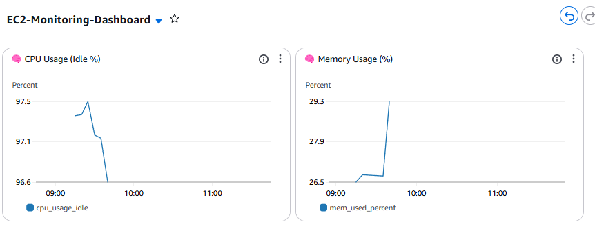
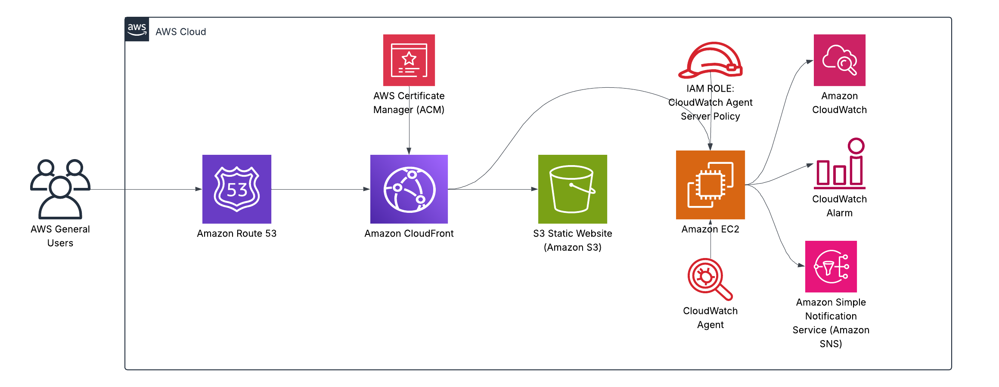

# 📊 EC2 Metrics Dashboard with CloudWatch


## 📋 Project Overview

This project implements a comprehensive CloudWatch dashboard to visualize real-time EC2 system metrics using the CloudWatch Agent. The dashboard provides critical performance insights while configurable alarms trigger SNS notifications when resource thresholds are breached.



---

## ✅ Key Features & Services

- 💻 **Amazon EC2** – Monitored instance running Ubuntu 22.04
- 📈 **CloudWatch Agent** – Collects system-level metrics from EC2
- 📊 **CloudWatch Dashboard** – Visualizes performance in real time
- 🚨 **SNS Alarms** – Sends email alerts for critical resource thresholds
- 🛠 **Manual Configuration** – Provides hands-on experience with agent setup
- 🧠 **SSM IAM Role** – Grants secure CloudWatch integration via EC2 instance profile

---

## 🔍 Monitored Metrics

- **CPU Usage (Idle %)**  
  Tracks available compute capacity to help identify under- or over-utilization.

- **Memory Usage (%)**  
  Indicates current RAM usage to support troubleshooting and capacity planning.

- **Disk Usage (% and Inodes)**  
  Monitors storage consumption and file system health.

- **Network Traffic**  
  Tracks inbound and outbound network activity.

---

## 📁 Project Structure

```bash
aws-ec2-monitoring-dashboard/
├── architecture/                       # AWS architecture diagram
│   ├── ec2-cloudwatch-dashboard.png    # Dashboard screenshot
│   └── aws-ec2-monitoring-dashboard-diagram.png  # Architecture diagram
├── scripts/                            # Manual installation scripts
│   ├── install-cloudwatch-agent.sh     # Agent installation script
│   └── cloudwatch-agent-config.json    # Agent configuration file
├── docs/                               # Additional documentation
│   └── ec2-metrics-logical-flow.md     # Detailed logical flow explanation
└── README.md                           
```

---

## 🗺️ Architecture Diagram



> 📌 **User** → **Route 53** → **CloudFront** → **EC2 Instance** (Ubuntu) → **Amazon CloudWatch Agent** → **CloudWatch Dashboard + Alarms + SNS**  
> 
> DNS resolution handled via Route 53, enabling HTTPS-secured traffic flow from browser to EC2. CloudWatch Agent runs on the EC2 instance, collects metrics (CPU, memory, disk), and publishes them to CloudWatch for real-time monitoring. Alarms notify via SNS when thresholds are breached.

---

## 🛠 Deployment Steps

1. **EC2 Instance Setup**
   - Launched Ubuntu EC2 instance in the free tier with a public IP
   - Attached an IAM role with CloudWatchAgentServerPolicy
   - Configured security groups for SSH access

2. **CloudWatch Agent Configuration**
   - Installed the CloudWatch Agent using the AWS-provided package
   - Created and uploaded custom configuration JSON to collect:
     - CPU usage (user, system, idle, iowait)
     - Memory usage (used, available, cached)
     - Disk usage (used%, inodes)
     - Network metrics (bytes in/out, packets)
   - Configured agent to run as a system service
   - Verified metrics were reporting to CloudWatch namespace `CWAgent`

3. **Dashboard & Alerts Setup**
   - Built a CloudWatch Dashboard with multiple metric widgets
   - Created CPU and memory-based alarms with appropriate thresholds
   - Configured SNS topic and email subscription for alerts
   - Tested alarm functionality by generating load on the instance

---

## 🧠 Skills Demonstrated

- EC2 instance provisioning and access via SSH
- IAM role assignment and permission troubleshooting
- CloudWatch Agent installation and JSON-based configuration
- Log and metric validation via terminal and console
- Alarm setup using metric thresholds and SNS integration
- Dashboard customization in AWS CloudWatch
- System-level monitoring best practices

---

## 🔄 Related Projects

- [Static Website Deployment](https://github.com/jimmyperalta-dev/aws-ec2-s3-route53-webapp)
- [Serverless Contact Form API](https://github.com/jimmyperalta-dev/aws-s3-lambda-api-contactform)

---

## </> Development Notes

This project was developed with assistance from AI tools like Claude to code and enhance documentation quality. All implementations were validated and tested by me.

---

## 👤 Author

**Jimmy Peralta**  
🛠️ Associate Media Systems Engineer | ☁️ AWS Cloud Enthusiast  
🌐 [https://www.deployjimmy.com](https://www.deployjimmy.com)
